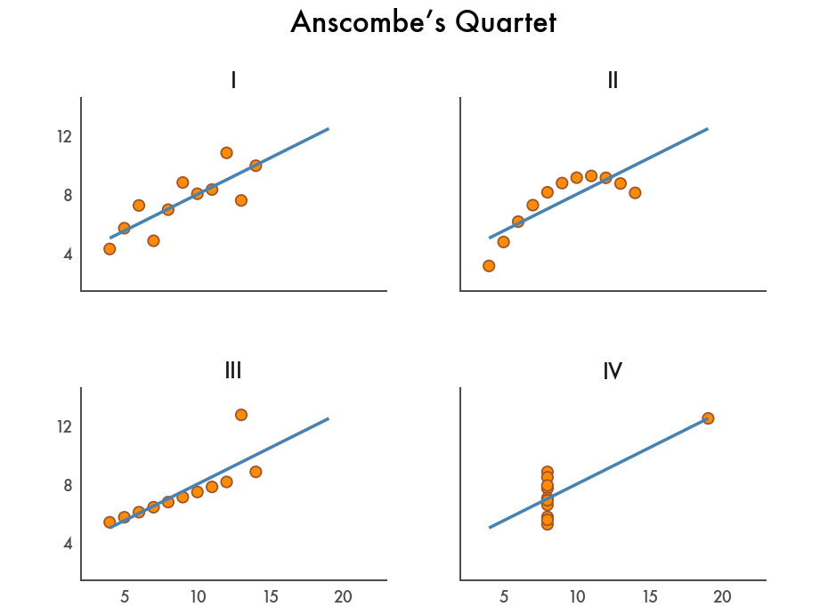

# Seeing Beyond Statistics: Anscombe’s Quartet and the Power of Graphs




In 1937, statistician Francis Anscombe challenged the commonly held
belief that “numerical calculations are exact, but graphs are rough”
(Anscombe, 1937). His strategy was to manually construct four small
datasets—now known as Anscombe’s Quartet—that have different
distributions but nearly identical descriptive statistics. It’s perhaps
the best argument for visualizing data.

In this notebook we replicate his paper by using Plotnine to visualize
those datasets and Polars to verify their descriptive statistics. More
specifically, we:

- Turn the original values that Anscombe used into one long DataFrame
- Verify the descriptive statistics
- Create a couple of exploratory data visualizations
- Fine-tune the visualization to make it suitable for communication

``` python
import polars as pl
from plotnine import *
```

## Create a Long DataFrame

First, we turn the original four datasets into one Polars DataFrame.
With 3 columns and 44 rows, the DataFrame is in long format, making it
convenient for Polars to compute descriptive statistics and for Plotnine
to visualize each row as a point. The column `dataset` indicates which
rows belong to which dataset using the Roman numerals `I` through `IV`.
(The Roman numerals are purely for visualization purposes.)

``` python
anscombe_datasets = [
    {"x": [10.0, 8.0, 13.0, 9.0, 11.0, 14.0, 6.0, 4.0, 12.0, 7.0, 5.0],
     "y": [8.04, 6.95, 7.58, 8.81, 8.33, 9.96, 7.24, 4.26, 10.84, 4.82, 5.68]},
    {"x": [10.0, 8.0, 13.0, 9.0, 11.0, 14.0, 6.0, 4.0, 12.0, 7.0, 5.0],
     "y": [9.14, 8.14, 8.74, 8.77, 9.26, 8.1, 6.13, 3.1, 9.13, 7.26, 4.74]},
    {"x": [10.0, 8.0, 13.0, 9.0, 11.0, 14.0, 6.0, 4.0, 12.0, 7.0, 5.0],
     "y": [7.46, 6.77, 12.74, 7.11, 7.81, 8.84, 6.08, 5.39, 8.15, 6.42, 5.73]},
    {"x": [8.0, 8.0, 8.0, 8.0, 8.0, 8.0, 8.0, 19.0, 8.0, 8.0, 8.0],
     "y": [6.58, 5.76, 7.71, 8.84, 8.47, 7.04, 5.25, 12.5, 5.56, 7.91, 6.89]}
]

anscombe_quartet = pl.concat([
    pl.DataFrame(xy).select(pl.lit(d).alias("dataset"), "x", "y")
    for d, xy in zip(["I", "II", "III", "IV"], anscombe_datasets)
])

anscombe_quartet
```

<div>
<small>shape: (44, 3)</small>

| dataset | x    | y    |
|---------|------|------|
| str     | f64  | f64  |
| "I"     | 10.0 | 8.04 |
| "I"     | 8.0  | 6.95 |
| "I"     | 13.0 | 7.58 |
| "I"     | 9.0  | 8.81 |
| "I"     | 11.0 | 8.33 |
| …       | …    | …    |
| "IV"    | 8.0  | 5.25 |
| "IV"    | 19.0 | 12.5 |
| "IV"    | 8.0  | 5.56 |
| "IV"    | 8.0  | 7.91 |
| "IV"    | 8.0  | 6.89 |

</div>

## Compute Descriptive Statistics

To verify that the four datasets have identical descriptive statistics,
we use Polars to compute the mean and the variance of both `x` and `y`.
We also compute the correlation between `x` and `y`:

``` python
pl.Config.set_float_precision(2)

anscombe_quartet.group_by("dataset", maintain_order=True).agg(
    pl.col("x", "y").mean().name.prefix("mean_"),
    pl.col("x", "y").var().name.prefix("variance_"),
    pl.corr("x", "y").alias("correlation_xy"),
)
```

<div>
<small>shape: (4, 6)</small>

| dataset | mean_x | mean_y | variance_x | variance_y | correlation_xy |
|---------|--------|--------|------------|------------|----------------|
| str     | f64    | f64    | f64        | f64        | f64            |
| "I"     | 9.00   | 7.50   | 11.00      | 4.13       | 0.82           |
| "II"    | 9.00   | 7.50   | 11.00      | 4.13       | 0.82           |
| "III"   | 9.00   | 7.50   | 11.00      | 4.12       | 0.82           |
| "IV"    | 9.00   | 7.50   | 11.00      | 4.12       | 0.82           |

</div>

As you can see, the descriptive statistics are nearly identical. At the
end of this notebook there’s a bonus section where we use scikit-learn
to fit a linear regression line to each dataset and verify that the
intercept, slope, and $R^2$ are also identical. (Spoiler alert: they
are!)

## Exploratory Data Visualization

Let’s create a few basic data visualizations to get a better feeling for
the data. What’s great about Plotnine is that you can get a first plot
with relatively little code. We have two continuous variables `x` and
`y`, so a scatter plot might work:

``` python
ggplot(anscombe_quartet, aes("x", "y")) + geom_point()
```


That doesn’t make much sense yet. We need a way to distinguish between
the datasets. Let’s color each point according to the dataset it belongs
to:

``` python
ggplot(anscombe_quartet, aes("x", "y", color="dataset")) + geom_point()
```


Well, that’s rather messy. Let’s create a panel for each dataset instead
using the `facet_wrap()` function instead. To make the code easier to
read and to edit, we’ll put each function on its own line:

``` python
(
    ggplot(anscombe_quartet, aes("x", "y", color="dataset")) +
    facet_wrap("dataset") +
    geom_point()
)
```


That’s better. The panels make the use of color redundant, so we’ll make
each point black again. Let’s also add a regression line using the
`geom_smooth()` function, to visualize that the four datasets have
identical descriptive statistics.

``` python
(
    ggplot(anscombe_quartet, aes("x", "y")) +
    geom_point() +
    geom_smooth(method="lm", se=False, fullrange=True, color="blue") +
    facet_wrap("dataset")
)
```


This data visualization clearly supports Anscombe’s point: that datasets
with different distributions can have the same descriptive statistics.

## A Fine-Tuned Data Visualization

Our final exploratory data visualization gets the job done, but it
doesn’t hurt to make it more visually appealing. In the following code
snippet, we:

- Remove many elements, including grid lines, tick marks, and axis
  labels. They’re not needed to bring the point across.
- Add a title.
- Change the colors and the font.

As you can see, there’s quite some code needed for this fine-tuning.
Luckily, because of its composable API, Plotnine allows you to gradually
move from a exploratory data visualization to a fine-tuned explanatory
one.

``` python
(
    ggplot(anscombe_quartet, aes("x", "y")) +
    geom_point(color="sienna", fill="darkorange", size=3) +
    geom_smooth(method="lm", se=False, fullrange=True, color="steelblue", size=1) +
    facet_wrap("dataset") +
    scale_y_continuous(breaks=(4, 8, 12)) +
    coord_fixed(xlim=(3, 22), ylim=(2, 14)) +
    labs(title="Anscombe’s Quartet") +
    theme_tufte(base_family="Futura") +
    theme(
        axis_line=element_line(color="#4d4d4d"),
        axis_ticks_major=element_line(color="#00000000"),
        axis_title=element_blank(),
        plot_background=element_rect(fill="#ffffff", color="#ffffff"),
        dpi=144,
        panel_spacing=0.09,
        strip_text=element_text(size=12),
        title=element_text(size=16, margin={"b": 20})
    )
)
```


``` python
_.save("anscombes-quartet.png")
```

## Bonus: Apply Linear Regression

In this bonus section, we use scikit-learn to fit a linear regression
line to each dataset and confirm that the intercept, slope, and $R^2$
are also identical. The `geom_smooth()` function added regression lines
to our scatter plots, but now we get to see the raw values as well.

``` python
from sklearn.linear_model import LinearRegression
from sklearn.metrics import r2_score

def fit_lr(s):
    lr = LinearRegression()
    X = s.struct.field("x").to_numpy().reshape(-1, 1)
    y = s.struct.field("y").to_numpy()

    # Compute intercept and coefficient
    lr.fit(X, y)
    intercept = lr.intercept_
    slope = lr.coef_[0]

    # Compute R^2
    r2 = r2_score(y, intercept + slope * X)
    
    return {"intercept": intercept, "slope": slope, "r2": r2}

anscombe_quartet.group_by("dataset", maintain_order=True).agg(
    pl.col("x", "y").mean().name.prefix("mean_"),
    pl.col("x", "y").var().name.prefix("variance_"),
    pl.corr("x", "y").alias("correlation_xy"),
    (
        pl.struct("x", "y")
        .map_elements(fit_lr, return_dtype=pl.Struct({"intercept": pl.Float64,
                                                      "slope": pl.Float64,
                                                      "r2": pl.Float64}))
        .alias("lr")
    )
).unnest("lr")
```

<div>
<small>shape: (4, 9)</small>

| dataset | mean_x | mean_y | variance_x | variance_y | correlation_xy | intercept | slope | r2   |
|---------|--------|--------|------------|------------|----------------|-----------|-------|------|
| str     | f64    | f64    | f64        | f64        | f64            | f64       | f64   | f64  |
| "I"     | 9.00   | 7.50   | 11.00      | 4.13       | 0.82           | 3.00      | 0.50  | 0.67 |
| "II"    | 9.00   | 7.50   | 11.00      | 4.13       | 0.82           | 3.00      | 0.50  | 0.67 |
| "III"   | 9.00   | 7.50   | 11.00      | 4.12       | 0.82           | 3.00      | 0.50  | 0.67 |
| "IV"    | 9.00   | 7.50   | 11.00      | 4.12       | 0.82           | 3.00      | 0.50  | 0.67 |

</div>

## References

- Anscombe, F. J. (1973). “Graphs in Statistical Analysis”. American
  Statistician. 27 (1): 17–21.
